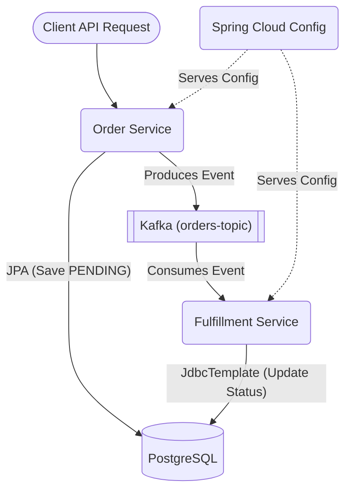

# Order Processing System - Microservices Sandbox


A comprehensive local microservices sandbox demonstrating the integration of modern enterprise technologies without relying on cloud-managed services.

## 🎯 Features & Technologies Demonstrated

*   **Java 21 & Virtual Threads**: The Order Service (Producer) is configured to utilize Java 21's Virtual Threads for highly scalable request handling.
*   **Java 8+ Streams API**: The Fulfillment Service demonstrates complex collection manipulation using the Streams API.
*   **Event-Driven Architecture**: Uses **Apache Kafka** as the event backbone to communicate between microservices asynchronously.
*   **Database & Data Access**: Uses **PostgreSQL** with two distinct data access patterns:
    *   **Spring Data JPA/Hibernate**: Used in the Order Service for standard CRUD operations.
    *   **JdbcTemplate**: Used in the Fulfillment Service to demonstrate complex or native querying.
*   **Dynamic Configuration**: A **Spring Cloud Config Server** manages properties dynamically. The Order Service utilizes `@RefreshScope` to update configurations at runtime without restarts.
*   **Observability**: Integrated with **Micrometer**, **Prometheus**, **Grafana**, and **Zipkin** for complete metrics scraping and distributed tracing across microservices and Kafka.
*   **Containerization & Orchestration**: Includes `Dockerfile`s for each service, a complete `docker-compose.yml` for local infrastructure, and basic **Kubernetes** manifests (`deployment.yaml`, `service.yaml`).

## 🏗️ Architecture Overview



## 🚀 How to Run Locally

### 1. Start Infrastructure
Start the supporting infrastructure (PostgreSQL, Kafka, Zookeeper, Zipkin, Prometheus, Grafana) using Docker Compose:
```bash
docker-compose up -d
```

### 2. Start the Microservices
You need to start the Spring Boot applications. **Important: Start the Config Server first.**

**Terminal 1 (Config Server):**
```bash
cd config-server
mvn spring-boot:run
```

**Terminal 2 (Order Service):**
```bash
cd order-service
mvn spring-boot:run
```

**Terminal 3 (Fulfillment Service):**
```bash
cd fulfillment-service
mvn spring-boot:run
```

## 🧪 Testing the System

### 1. Create an Order
Send a POST request to the Order Service (running on port `8081`):

```bash
curl -X POST http://localhost:8081/api/orders \
-H "Content-Type: application/json" \
-d '{
    "customerId": "CUST123",
    "items": ["Laptop", "Mouse", "Keyboard"],
    "totalAmount": 1250.00
}'
```

### 2. Verify Output
1. The Order Service saves the order as `PENDING` and produces an event to Kafka.
2. The Fulfillment Service logs will show it consuming the message and processing the items.
3. Check the PostgreSQL database (`orderdb`) to see the records in both the `orders` and `fulfillment_status` tables.

### 3. Dynamic Configuration Refresh
1. Modify `app.dynamic.message` in `config-repo/order-service.yml`.
2. View the current message: `curl http://localhost:8081/api/orders/config-message`
3. Trigger a refresh: `curl -X POST http://localhost:8081/actuator/refresh`
4. View the message again to see it updated without restarting the service!

### 4. Observability Dashboards
- **Zipkin Tracing**: Navigate to `http://localhost:9411`
- **Prometheus Metrics**: Navigate to `http://localhost:9090`
- **Grafana**: Navigate to `http://localhost:3000` (User: `admin`, Pass: `admin`)

## ☸️ Kubernetes Deployment

Detailed Kubernetes manifests are provided in the `k8s/` directory to deploy the microservices and backing infrastructure services natively inside a cluster.

### 1. Build and Package the Applications
Compile and package the Spring Boot applications:
```bash
cd config-server && mvn clean package -DskipTests
cd ../order-service && mvn clean package -DskipTests
cd ../fulfillment-service && mvn clean package -DskipTests
cd ..
```

### 2. Build the Local Docker Images
Ensure your Kubernetes context is set to your local cluster (e.g., `docker-desktop`). If using the containerd image store in Docker Desktop, disable **"Use containerd for pulling and storing images"** in settings first so that Kubernetes can access these local images.

Build the images from the root directory:
```bash
docker build -t config-server:latest config-server
docker build -t order-service:latest order-service
docker build -t fulfillment-service:latest fulfillment-service
```

### 3. Create the Configuration ConfigMaps
Create the ConfigMaps required for the Config Server native files and database initializations:
```bash
kubectl create configmap config-repo-properties --from-file=config-repo/
kubectl create configmap postgres-init-sql --from-file=init-db.sql
```

### 4. Deploy Infrastructure and Applications
Apply all Kubernetes manifests:
```bash
# 1. Deploy Databases, Messaging, and Tracing
kubectl apply -f k8s/postgres.yaml
kubectl apply -f k8s/kafka.yaml
kubectl apply -f k8s/zipkin.yaml

# 2. Deploy Prometheus and Grafana
kubectl apply -f k8s/monitoring.yaml

# 3. Deploy the Microservices
kubectl apply -f k8s/deployment.yaml
kubectl apply -f k8s/service.yaml
```

Check the pod status until all pods are healthy and running:
```bash
kubectl get pods
```

### 5. Access the Services (Port-Forwarding)
Since Kubernetes NodePorts can sometimes fail to route on the host locally, use `kubectl port-forward` to establish reliable direct tunnels:
```bash
# Run each in separate terminal windows:
kubectl port-forward service/order-service 8081:8081
kubectl port-forward service/fulfillment-service 8082:8082
kubectl port-forward service/zipkin 9411:9411
kubectl port-forward service/prometheus 9090:9090
kubectl port-forward service/grafana 3000:3000
```

### 6. Testing the Kubernetes Flow
Send a test POST request using PowerShell:
```powershell
Invoke-RestMethod -Uri "http://localhost:8081/api/orders" -Method Post -Headers @{"Content-Type" = "application/json"} -Body '{"customerId": "CUST123", "items": ["Laptop", "Mouse"], "totalAmount": 1200.00}'
```
Or using Command Prompt / Bash:
```bash
curl.exe -g -X POST http://localhost:8081/api/orders -H "Content-Type: application/json" -d "{\"customerId\": \"CUST123\", \"items\": [\"Laptop\", \"Mouse\"], \"totalAmount\": 1200.00}"
```
Verify the processing logs:
```bash
kubectl logs -l app=fulfillment-service -f
```

